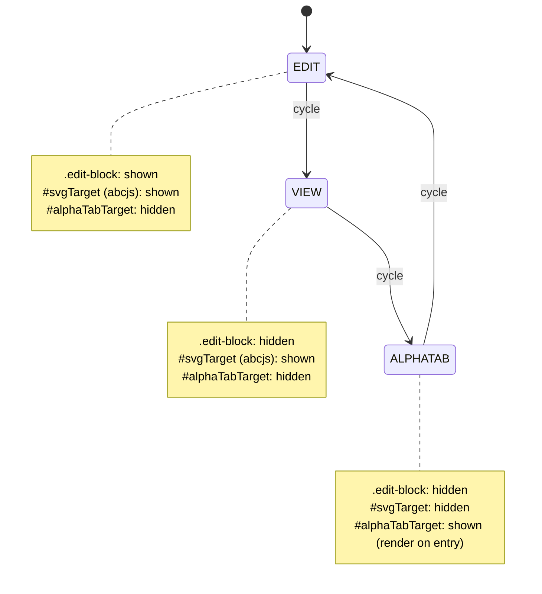
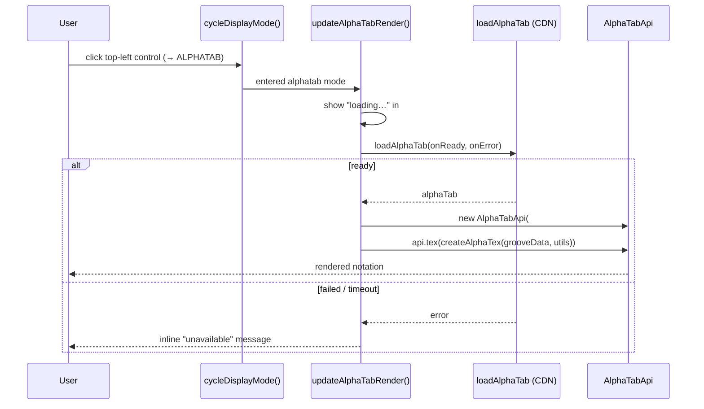

# feat: ALPHATAB view mode

## Summary

Add a third top-level mode, **ALPHATAB**, to GrooveScribe's EDIT/VIEW switch. Entering it renders the current groove as alphaTab (Guitar Pro) notation, read-only, drawn once on entry, into a dedicated container. EDIT, VIEW, abcjs print, and share are unchanged. The render reuses the already-exported `GrooveToGuitarPro.createAlphaTex()` fed to a lazily-created `alphaTab.AlphaTabApi`, with inline loading / unavailable states when the CDN library is not ready.

---

## Problem Frame

GrooveScribe renders notation with abcjs into `#svgTarget`. The Guitar Pro export on this branch loads alphaTab from a CDN but uses it headlessly — only `AlphaTexImporter` + `Gp7Exporter` to build a `.gp` file; the rendering engine is loaded but never instantiated. To see a groove as Guitar Pro notation today, a user must download the `.gp` and open it in an external app. This feature surfaces alphaTab's render in-app as a sibling view, and is the visual counterpart to the existing read-only "Show AlphaTex" text panel (commit `7e8ea817`). See origin: `docs/brainstorms/2026-06-12-alphatab-view-mode-requirements.md`.

---

## Requirements Traceability

Origin requirements (`R1`–`R10`) and acceptance examples (`AE1`–`AE5`) carry forward verbatim. Mapping to implementation units:

| Origin | Covered by |
|---|---|
| R1, R2, R3 (mode & control) | U2 |
| R4, R5, R6 (rendering) | U3 |
| R7, R8 (loading & failure) | U3 |
| R9 (non-regression) | U1, U2 (verification) |
| R10 (DOM-free module) | U3 (render reuses exported `createAlphaTex`; no edits to `js/groove_to_guitarpro.js`) |

---

## Key Technical Decisions

**KTD1 — Additive 3-state cycle layered on the existing `viewMode` boolean.** Keep `root.myGrooveUtils.viewMode` semantics (`true` ⟹ `.edit-block` hidden) and add an `alphaTab-active` flag that is only meaningful while `viewMode` is true. The cycle is EDIT → VIEW → ALPHATAB → EDIT. This preserves the page-load `?Mode=view` path (`js/groove_writer.js` `runsOnPageLoad`, ~line 3441) and every existing `viewMode` read, instead of ripping the boolean out for an enum. (Open Questions records the enum alternative.)

**KTD2 — Render via `AlphaTabApi.tex(createAlphaTex(...))`, not the internal `buildScore`.** `GrooveToGuitarPro.createAlphaTex(grooveData, grooveUtils)` is already exported, DOM-free, and unit-tested; `AlphaTabApi` accepts an alphaTex string directly via `.tex()`. Feeding the string to the renderer reuses the tested generator and means **no change to `js/groove_to_guitarpro.js`** (honoring R10). `buildScore` stays internal.

**KTD3 — Reuse the existing `loadAlphaTab` loader unchanged; render on entry only.** The CDN loader (`js/alphatab_loader.js`, instantiated at `js/groove_writer.js` ~line 2540) already dedupes injection, runs a 15s watchdog, and resets for retry. Its `apiReady` check (`importer.AlphaTexImporter`) is satisfied by the same full `alphaTab.min.js` bundle that carries `AlphaTabApi`, so it gates rendering correctly. Because ALPHATAB hides the `.edit-block` grid, the groove cannot change while the mode is active — so the render is triggered from the mode-switch handler, **not** wired into `updateSheetMusic()`.

**KTD4 — Inline loading / unavailable status inside the render container.** Unlike the export path (which `alert()`s on load failure — `GPSaveAs`, ~line 2570), a mode the user is sitting in should show status in place: a "loading…" placeholder while the CDN script is in flight, and an inline "unavailable" message on error/timeout. Other modes keep working.

**KTD5 — Lazy `AlphaTabApi` instantiation with explicit render settings.** Rendering needs assets the headless export deliberately avoids (the loader comment notes "no Web Worker, audio, or font assets load"): the Bravura music font and a layout worker. The API is created on first entry into ALPHATAB and configured display-only (no player). Font-directory and worker settings are an implementation-time detail (see Open Questions + Risks) because they depend on observed runtime behavior from the jsdelivr bundle.

---

## High-Level Technical Design

*Directional — the implementer owns exact representation.*

Three display states and their element visibility:

Render-on-entry data flow:

The top-left control's `#view-edit-switch` label always names the **next** mode: EDIT→"Switch to VIEW mode", VIEW→"Switch to ALPHATAB mode", ALPHATAB→"Switch to EDIT mode".

---

## Implementation Units

### U1. Render container, control wiring, theme CSS, SW bump

**Goal:** Scaffold the DOM and styling the mode machine and renderer need.

**Requirements:** R1, R9.

**Dependencies:** none.

**Files:**
- `index.html` — add `#alphaTabTarget` container (hidden by default) adjacent to `#svgTarget`; point the top-left control (`index.html:93`, currently `onclick="myGrooveWriter.swapViewEditMode();"`) at the new cycle entry point from U2.
- `css/groove_writer_orange.css` — style `#alphaTabTarget` and an `.alphaTabStatus` message, mirroring the dark/orange chrome of `#alphaTexOutput` (lines ~1222-1273).
- `css/groove_writer.css` — parallel styling only if that theme is active (verify; see Open Questions).
- `sw.js` — bump `version` (index.html shell changed). Note the existing `ALPHATAB_CDN_URL` duplication comment at `js/groove_writer.js:2528`.

**Approach:** Container is an empty `
` that alphaTab will populate. Keep `#svgTarget` exactly as-is; mode logic (U2) toggles visibility. No behavior in this unit beyond markup/CSS/version.

**Patterns to follow:** the `#alphaTexOutput` / `#alphaTexContent` panel (markup `index.html:193-202`, CSS `css/groove_writer_orange.css:1222`); the existing `sw.js` version bump done in commit `7e8ea817` (1.2.4 → 1.2.5).

**Test scenarios:**
- Test expectation: none — pure markup/CSS/version scaffolding; behavior is exercised by U2/U3. Verify the SW `version` string changed and the page still loads with `#alphaTabTarget` present and hidden.

**Verification:** `#alphaTabTarget` exists, is `display:none` on load, and EDIT/VIEW are visually unchanged; `sw.js` version differs from the previous commit.

---

### U2. Display-mode cycle state machine

**Goal:** Turn the binary EDIT/VIEW switch into an EDIT → VIEW → ALPHATAB → EDIT cycle that shows/hides the right elements and updates the control label, without breaking page-load behavior.

**Requirements:** R1, R2, R3, R9.

**Dependencies:** U1.

**Files:**
- `js/groove_writer.js` — add `root.cycleDisplayMode()` and the alphaTab-active state; compose with the existing `root.swapViewEditMode` (~line 3406); update `#view-edit-switch` label per next mode; show/hide `#svgTarget` vs `#alphaTabTarget`.
- `jstools/display-mode.test.mjs` *(new, optional but recommended)* — node test for a pure `nextDisplayMode(current)` helper.

**Approach:** Extract a pure `nextDisplayMode('edit'|'view'|'alphatab')` transition function (testable in the Node suite, mirroring why `alphatab_loader.js` was extracted). The DOM glue: entering ALPHATAB hides `.edit-block` (reuse `showHideCSS_ClassDisplay(".edit-block", true, false, "block")` as VIEW does) and `#svgTarget`, shows `#alphaTabTarget`, and calls `updateAlphaTabRender()` (U3); leaving ALPHATAB hides `#alphaTabTarget` and restores `#svgTarget`. Preserve `swapViewEditMode(dontUpdateURL)`'s existing EDIT↔VIEW contract for the `runsOnPageLoad` caller (~line 3442) and `updateCurrentURL()` behavior. ALPHATAB does not write to the URL (persistence deferred — Scope Boundaries).

**Technical design (directional):** keep `viewMode` as the "non-edit" boolean; add `class_alphaTabActive`. `cycleDisplayMode()` reads the current (viewMode, alphaTabActive) pair, computes the next via `nextDisplayMode`, applies element visibility, sets the label, and triggers the render on ALPHATAB entry.

**Patterns to follow:** `root.swapViewEditMode` (`js/groove_writer.js:3406`); `showHideCSS_ClassDisplay` usage there; the `#view-edit-switch` label-swap idiom.

**Test scenarios:**
- `nextDisplayMode('edit')` → `'view'`; `nextDisplayMode('view')` → `'alphatab'`; `nextDisplayMode('alphatab')` → `'edit'` (Node test).
- Covers AE5. From EDIT, one cycle → VIEW: `.edit-block` hidden, `#svgTarget` visible, `#alphaTabTarget` hidden, label reads "Switch to ALPHATAB mode" — abcjs/print/share unchanged.
- Covers AE1 (mode half). From VIEW, cycle → ALPHATAB: `#svgTarget` hidden, `#alphaTabTarget` visible, `.edit-block` stays hidden; cycle again → EDIT: grid back, `#svgTarget` visible, `#alphaTabTarget` hidden.
- Page-load `?Mode=view` still lands in VIEW (not ALPHATAB); `?Mode=edit`/default lands in EDIT.
- Print while in ALPHATAB still reads `#svgTarget` innerHTML (display-agnostic) and is unaffected.

**Verification:** cycling the control walks all three modes with correct visibility + labels; existing edit/view URL behavior intact; Node suite green (50 + any new).

---

### U3. alphaTab render-on-entry with loading / unavailable states

**Goal:** Render the current groove as alphaTab notation when ALPHATAB is entered, with graceful loading and failure states, keeping `js/groove_to_guitarpro.js` DOM-free.

**Requirements:** R4, R5, R6, R7, R8, R10.

**Dependencies:** U2.

**Files:**
- `js/groove_writer.js` — add `root.updateAlphaTabRender()`: early-return unless alphaTab mode is active (mirror `updateAlphaTexDisplay`'s visibility early-return); show a "loading…" placeholder; call the existing `loadAlphaTab(onReady, onError)`; on ready, lazily create one `AlphaTabApi(#alphaTabTarget, settings)` and call `api.tex(GrooveToGuitarPro.createAlphaTex(root.grooveDataFromClickableUI(), root.myGrooveUtils))`; on error, render the inline "unavailable" message.

**Approach:** Reuse the module-level `loadAlphaTab` (KTD3) — do not add a second loader. Instantiate `AlphaTabApi` once (memoize on first render) and re-`.tex()` on subsequent entries; configure display-only (no `player`). Font/worker settings (`settings.core.fontDirectory`, `settings.core.useWorkers`) are resolved at implementation time against the jsdelivr bundle behavior (Risks + Open Questions). No edits to `js/groove_to_guitarpro.js`; all DOM/render glue lives here.

**Patterns to follow:** `root.updateAlphaTexDisplay` early-return + render-into-element (`js/groove_writer.js:2701`); the `loadAlphaTab(onLoad, onError)` call shape in `root.GPSaveAs` (~line 2552), but with inline status instead of `alert()`.

**Test scenarios:**
- Covers AE1 (render half). Build a groove, enter ALPHATAB → notation for that groove renders; return to EDIT, change a note, re-enter ALPHATAB → render reflects the change (re-render on entry).
- Covers AE2 (empty groove). Empty groove → `createAlphaTex` yields the valid one-bar rest → renders with no thrown error / no console error.
- Covers AE3. Enter ALPHATAB on a cold load before the CDN script resolves → "loading…" placeholder shows, then notation appears once `loadAlphaTab` fires `onReady`.
- Covers AE4. With alphaTab forced to fail (offline / blocked CDN / watchdog timeout) → inline "unavailable" message in `#alphaTabTarget`; EDIT and VIEW remain fully usable; no unhandled exception.
- Re-entering ALPHATAB after a prior successful render reuses the API (no duplicate canvases/SVGs stacking in the container).

**Verification:** entering ALPHATAB renders the live groove; empty groove safe; loading and unavailable states both observable; `js/groove_to_guitarpro.js` unchanged (`git diff` shows no edits to it).

---

## Scope Boundaries

### Deferred to Follow-Up Work
- alphaTab audio playback and follow cursor.
- alphaTab-based print, share, or image export — print/share stay abcjs.
- Remembering ALPHATAB across reloads (mode persistence / `?Mode=alphatab` URL round-trip).

### Outside this feature's identity
- Replacing or retiring the abcjs view anywhere. abcjs remains canonical and the basis for print/share.
- Editing the groove from within ALPHATAB mode (the grid is hidden by design).

---

## Risks & Dependencies

- **Font + worker assets (highest risk).** Rendering needs the Bravura music font and a layout worker that the headless export path deliberately never loads (loader comment, `js/groove_writer.js:2534`). alphaTab derives `fontDirectory` from its `<script>` element, but the loader injects the script with `id="alphaTabScript"`, so auto-detection may not resolve the jsdelivr `dist/font/` path. Mitigation: set `settings.core.fontDirectory` explicitly to the CDN font dir and/or set `useWorkers=false`; verify glyphs render in-browser. This is the most likely source of "blank render" failure.
- **Service worker interference.** `sw.js` may cache/deny the new font + worker fetches. Mitigation: bump `version` (U1); confirm the font/worker requests succeed (network passthrough or runtime-cache); the CDN URL is duplicated in `sw.js` per the existing note.
- **`viewMode` coupling.** Any code that reads `viewMode === true` and assumes abcjs (`#svgTarget`) is visible would be wrong in ALPHATAB (viewMode true, abcjs hidden). Mitigation: grep all `viewMode` reads before finalizing U2; print reads `#svgTarget` innerHTML regardless of display, so it is unaffected.
- **CSP / SRI.** The bundle is SRI-pinned; the separately-fetched font/worker are not covered by that SRI (expected), but the page CSP must permit them from the jsdelivr origin.
- **Dependency:** alphaTab `@coderline/alphatab@1.8.3` full bundle (`alphaTab.min.js`) already loaded on this branch — confirmed to include `AlphaTabApi` rendering.

---

## Open Questions (Deferred to Implementation)

- Exact `AlphaTabApi` settings for a clean read-only drum view: layout mode (page vs. horizontal), scale, `player` disabled, `core.useWorkers`, `core.fontDirectory`.
- Reuse one memoized `AlphaTabApi` and re-`.tex()` on re-entry (chosen default) vs. destroy/recreate per entry — confirm no stale-render artifacts with reuse.
- Whether `css/groove_writer.css` (non-orange theme) is active in the shipped `index.html` and needs parallel CSS, or only `css/groove_writer_orange.css`.
- Whether to keep the layered `viewMode` + `alphaTabActive` flags (chosen) or refactor to a single `displayMode` enum with a `viewMode` compatibility getter.

---

## Sources & Research

- Mode toggle + page-load mode handling: `root.swapViewEditMode` (`js/groove_writer.js:3406`), `runsOnPageLoad` `?Mode=` check (~line 3441); top-left control markup `index.html:93`.
- abcjs render target: `updateSheetMusic` / `displayNewSVG` writing `#svgTarget` (`js/groove_writer.js:3008`, `3031`).
- alphaTex generator (DOM-free, exported, tested): `GrooveToGuitarPro.createAlphaTex` used at `js/groove_writer.js:2711`.
- CDN loader + watchdog + readiness check: `js/alphatab_loader.js`; instantiated at `js/groove_writer.js:2540`; URL/SRI at `2531-2532`; load-error UX in `root.GPSaveAs` (~`2552`).
- Sibling render-into-element-when-visible pattern: `root.updateAlphaTexDisplay` / `toggleAlphaTexDisplay` (`js/groove_writer.js:2701`); panel CSS `css/groove_writer_orange.css:1222`.
- Origin requirements: `docs/brainstorms/2026-06-12-alphatab-view-mode-requirements.md`. Prior GP export design/plan: `docs/superpowers/specs/2026-06-10-guitar-pro-export-design.md`, `docs/superpowers/plans/2026-06-10-guitar-pro-export.md`.
